# 🎬 LEGACY Kometa Config & Images

  

Custom images and YAML configurations for [Kometa](https://kometa.wiki), built to supercharge your Plex experience with smart collections, overlays, and metadata magic.

The posters are generated using [Posterizarr](https://github.com/fscorrupt/Posterizarr) and then managed via [Kometa](https://kometa.wiki) to create collections and apply overlays automatically.  
I'm using a mix of artwork from [Posterizarr](https://github.com/fscorrupt/Posterizarr), [ThePosterDB](https://theposterdb.com), and [MediUX](https://mediux.pro).

All posters for the [**Universes**](#-universes) and [**Movie Lists**](#-movie-lists) were custom-designed by me using Photoshop and are located in the `/posters/` folder.  
Posters for [**Actors**](#-actors), [**Directors**](#-directors), [**Decades**](#-decades), [**Studios**](#-studios--originals), and [**Originals**](#-studios--originals) are sourced from TMDb, IMDb, or ThePosterDB.

---

## 📂 Contents

This repo includes support for:

- [🎭 **Actors**](#-actors) – Smart collections for top actors with matching posters  
- [🎬 **Directors**](#-directors) – Curated filmographies from famous directors and writers  
- [🕰️ **Decades**](#d-ecades) – Best movies grouped by decade  
- [🎞️ **Resolution**](#-resolution) – Collections based on video quality (4K, 1080p, DV, Remux, etc.)  
- [🏷️ **Editions & Formats**](#-editions--formats) – IMAX, Extended, Remux, CAM, TS, and more  
- [🧠 **IMDb Charts**](#-imdb-charts) – Popular and Top 250 lists with custom filters  
- [🎯 **TMDb Charts**](#-tmdb-charts) – Popular and Top Rated collections  
- [🏆 **Oscars**](#-oscars) – Winners by year and category (e.g., Best Picture, Director)  
- [📋 **Movie Lists**](#-movie-lists) – Handpicked themes (Apocalyptic, Heist, Stoner, etc.)  
- [🏢 **Studios & Originals**](#-studios--originals) – Group movies by studio or streaming platform  
- [🌌 **Universes**](#-universes) – Movie and series universes like MCU, Star Wars, X-Men, etc.  
- [📺 **TV Show Lists**](#-tv-show-lists) – Sitcoms, top episodes, nostalgia shows, video game adaptations  
- [🔁 **Chronological TV Orders**](#-chronological-tv-orders) – Ordered episodes (e.g., Star Wars: The Clone Wars)  
- [👤 **Person-Based Lists**](#-person-based-lists) – Lists from creators like BeHaind, BelYves  
- [🖼️ **Overlays for Movies**](#-overlays-for-movies) – Resolutions, formats  
- [🖼️ **Overlays for TV Shows**](#-overlays-for-tv-shows) – Streaming network overlays  

---

### 🎭 Actors

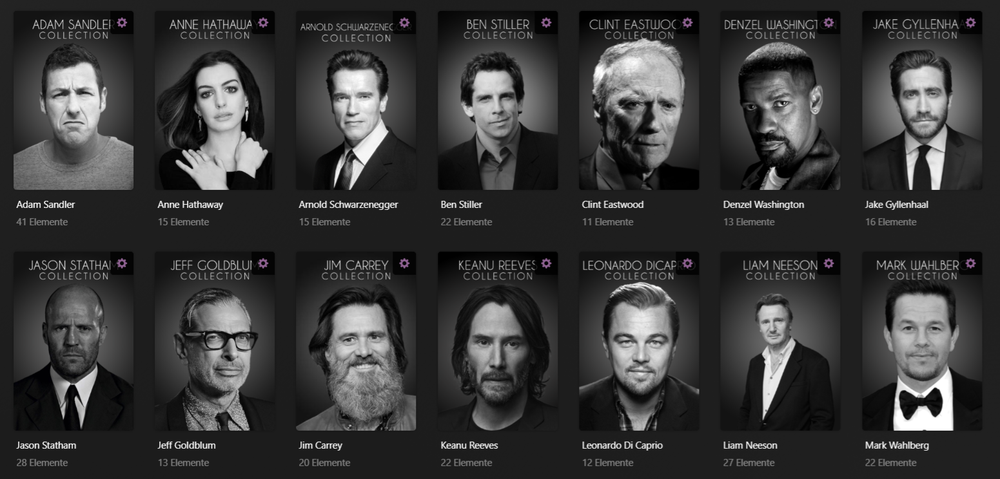  
Smart collections for popular actors using TMDB IDs and custom ThePosterDB posters.

---

### 🎬 Directors

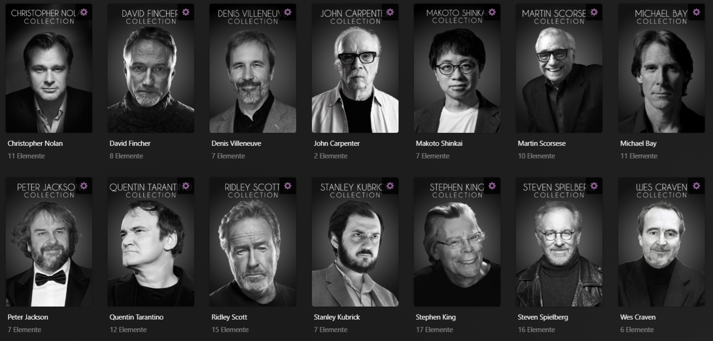  
Curated director collections with full filmographies and matching posters.

---

### 🕰️ Decades

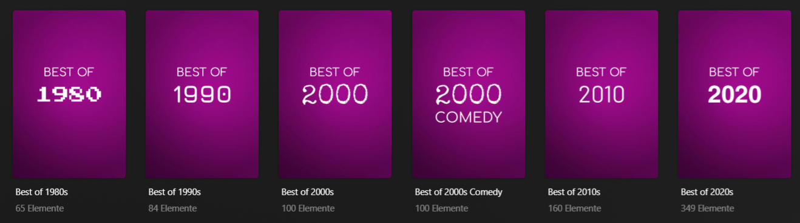  
Collections of the best movies from each decade (60s–2020s).

---

### 🎞️ Resolution

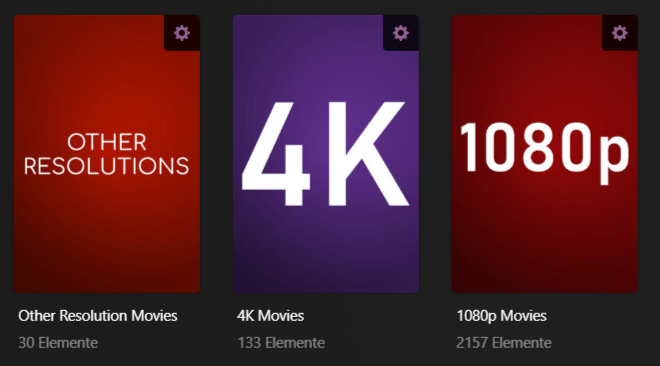  
Organize your media by quality: 4K, 1080p and other resolutions.

---

### 🏷️ Editions & Formats

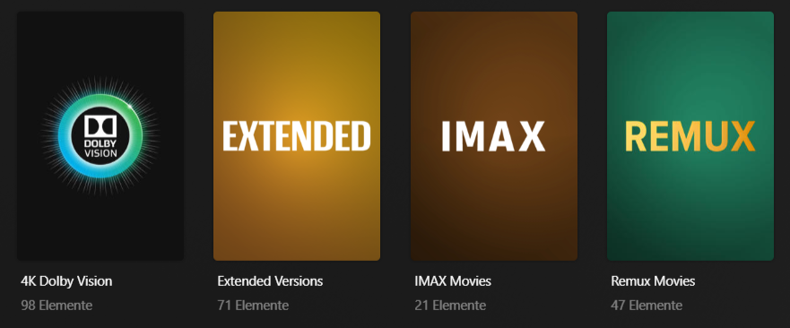  
Special editions like IMAX, Extended, Remux, 4K Dolby Vision

---

### 🧠 IMDb Charts

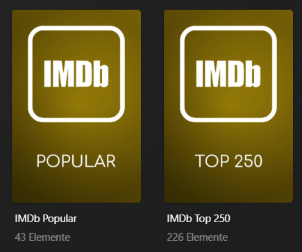  
Auto-generated collections from IMDb Popular and Top 250 lists.

---

### 🎯 TMDb Charts

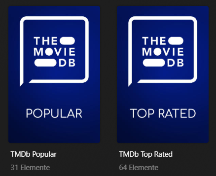  
Top rated and popular movies based on TMDb data.

---

### 🏆 Oscars

  
Collections for Best Picture, Director, and dynamic yearly winners.

---

### 📋 Movie Lists

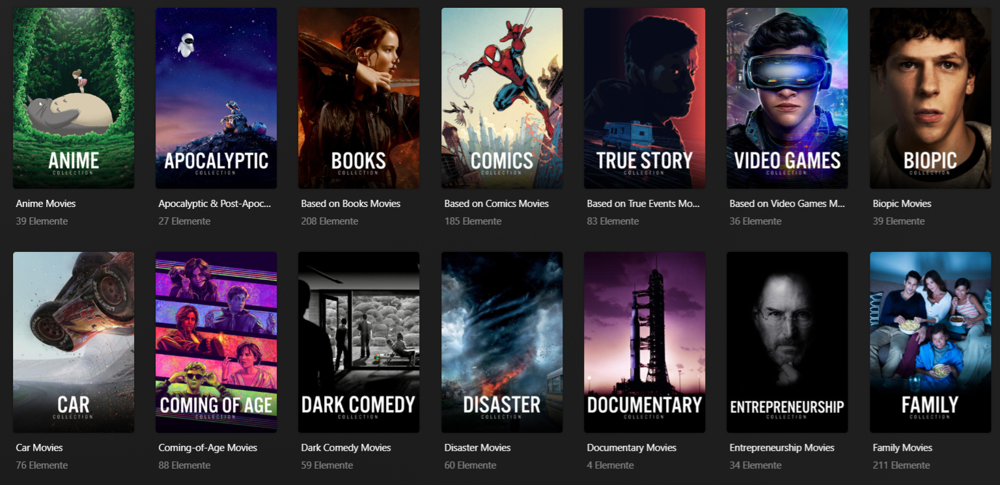  
Themed collections like Apocalyptic, Heist, Mindfuck, Stoner Movies, etc.

---

### 🏢 Studios & Originals

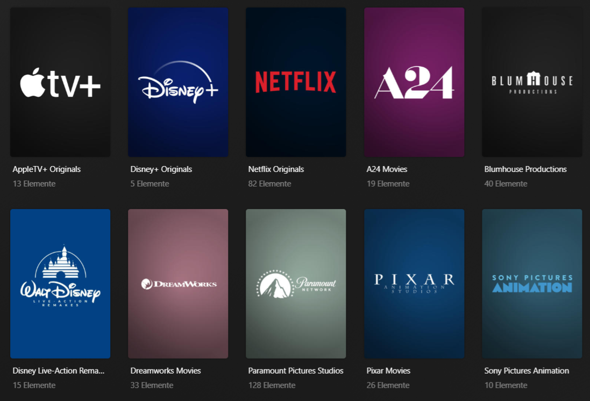  
Group films by production studios or streaming platforms.

---

### 🌌 Universes

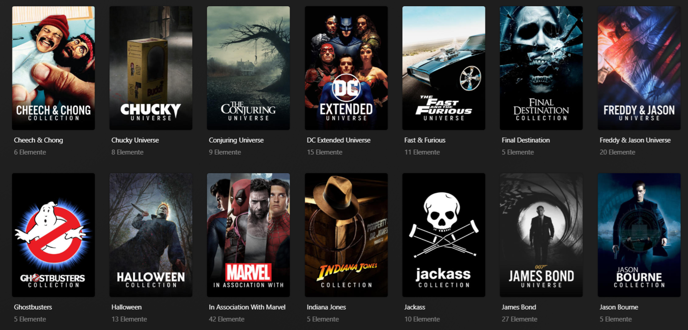  
Cinematic universes like MCU, Star Wars, X-Men, Wizarding World, and more.

---

### 📺 TV Show Lists

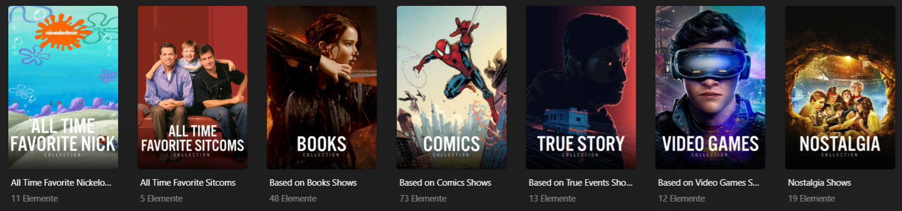  
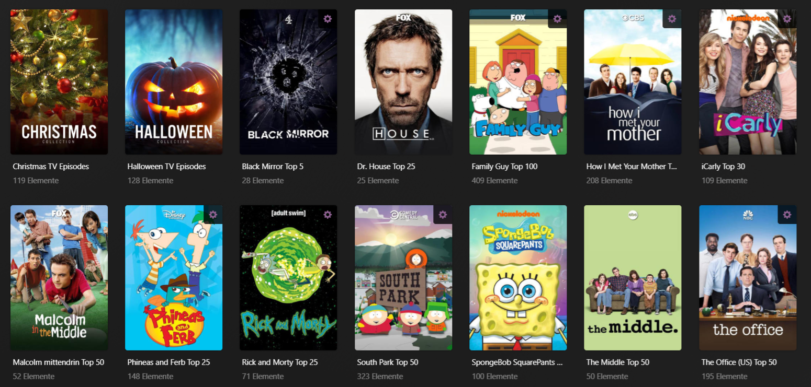  
Favorite sitcoms, nostalgia shows, top episodes and adaptations from games/books.

---

### 🔁 Chronological TV Orders

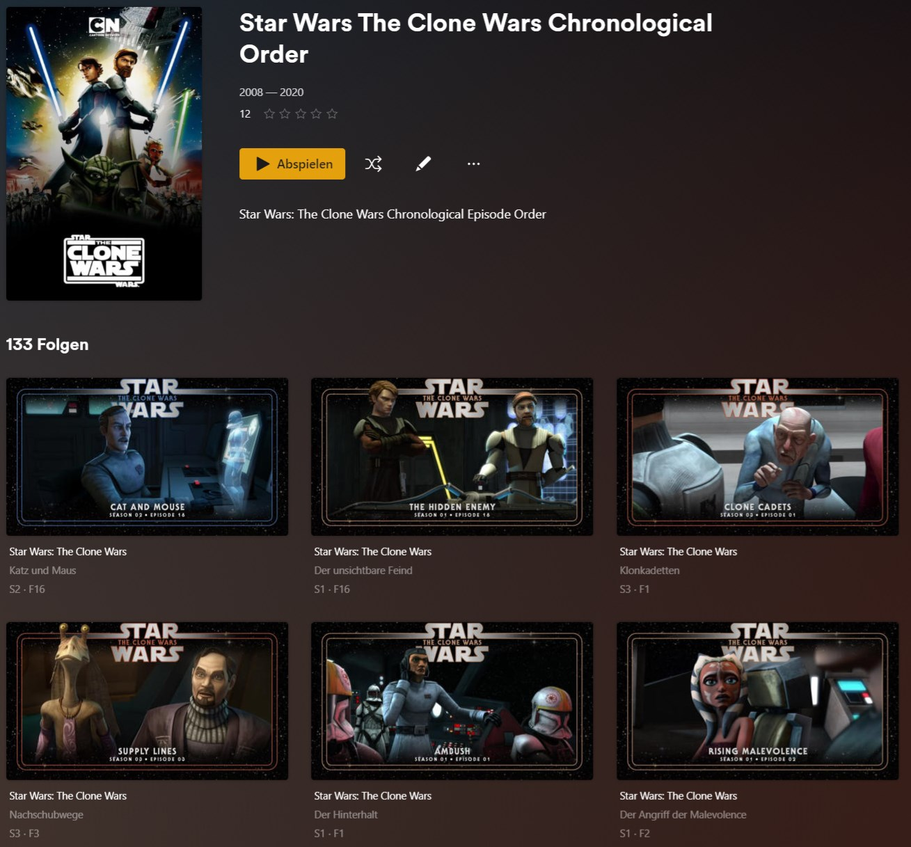  
TV episode collections sorted in official chronological order (e.g., Clone Wars). Based on Trakt lists.

---

### 👤 Person-Based Lists

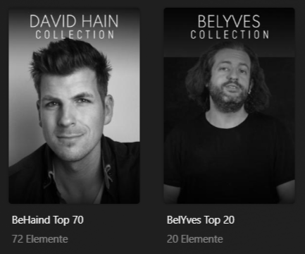  
IMDb lists from creators like BeHaind and BelYves.

---

### 🖼️ Overlays for Movies

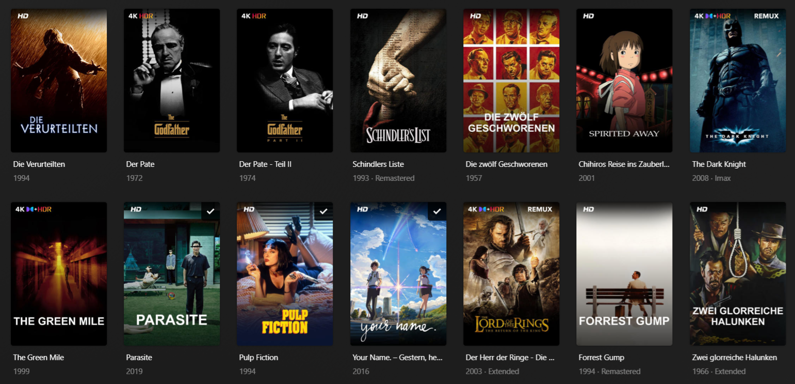  
Visual overlays for resolution and video format.

---

### 🖼️ Overlays for TV Shows

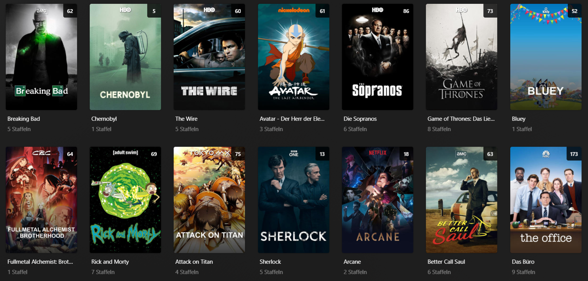  
Network overlays for series like Netflix, HBO, Prime, etc.

---

## 📸 Screenshots Folder

All sample images are stored under the `/screenshots/` directory.

---

## 🙏 Acknowledgments

This setup combines the power of:
- [Kometa](https://kometa.wiki)
- [Posterizarr](https://github.com/fscorrupt/Posterizarr)
- [ThePosterDB](https://theposterdb.com)
- [MediUX](https://mediux.pro/)
- [Trakt](https://trakt.tv)
- [TMDb](https://www.themoviedb.org)
- [IMDb](https://www.imdb.com)
- [mdblist](https://mdblist.com/)

---

## 🚀 More Projects

If you like this repo, check out my other tools:

- 🎥 [PlexWatch](https://github.com/nichtlegacy/PlexWatch) – Discord bot for real-time Plex stream & server monitoring  
- 📢 [Plexboxd](https://github.com/nichtlegacy/Plexboxd) – Log Plex watches to Letterboxd + send rich Discord notifications  
- 📈 [Letterboxd Graph](https://github.com/nichtlegacy/letterboxd-graph) – GitHub-style graph of your Letterboxd activity for GitHub profiles  
- 📉 [Trakt Graph](https://github.com/nichtlegacy/trakt-graph) – GitHub-style graph of your Trakt watch history for GitHub profiles  

---

Use this repo as a foundation and expand your own Plex experience! Enjoy your upgraded Plex library! 🎉